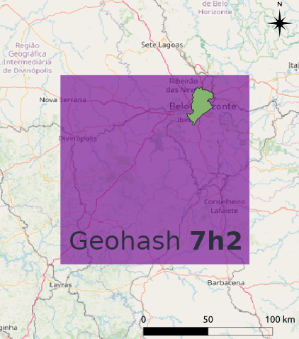
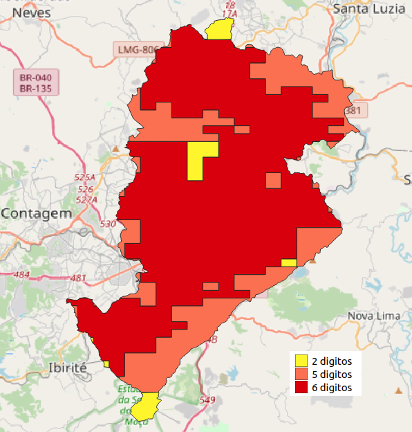
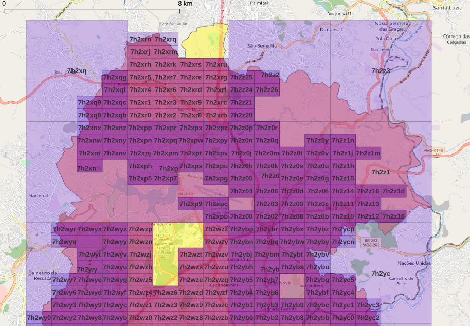
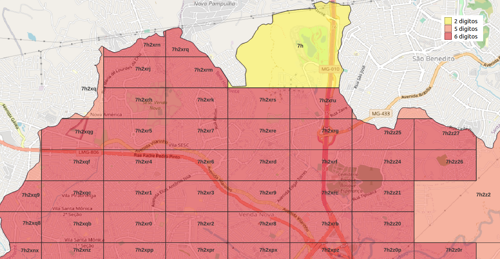
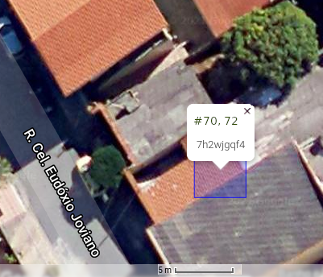
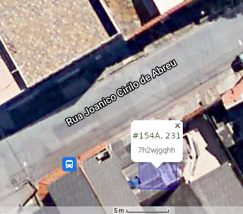
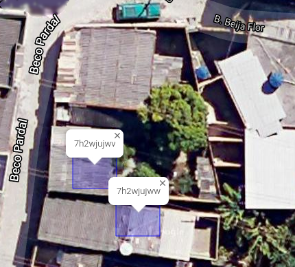
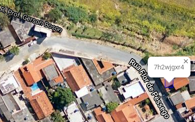
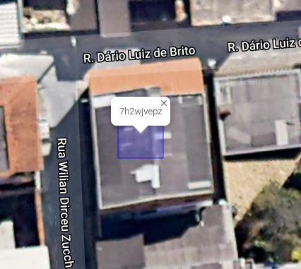

## Endereços de Belo Horizonte

O município de Belo Horizonte (MG) está contido no Geohash `7h2`: 

Dentro dele os endereços podem ser distribuídos por células Geohash de diferentes tamanhos, a maioria com 5 ou seis dígitos, coforme a densidade local de domicílios:

O resultado foi a distribuição de arquivos GeoJSON com tamanhos variando de 500 a 5000 pontos de endereço

<!--  -->

## problemas com os endereços fornecidos

