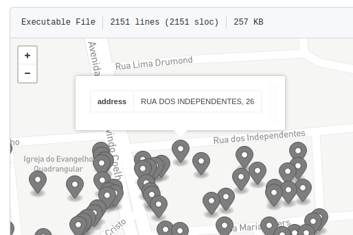

## Endereços de Belo Horizonte
Na pasta [geoaddress](geoaddress) encontram-se todos os pontos de localização geográfica com respectivos dados de endeço.
Por exemplo a <br/>*"RUA DOS INDEPENDENTES, 26"* encontra-se no arquivo [`pts_7h2wjv.geojson`](geoaddress/pts_7h2wjv.geojson) da pasta. <br/>O nome do arquivo pode ser lido da seguinte forma:
* prefixo `pts_` e extensão `.geojson` indica que são pontos formatados em GeoJSON.
* `7h2wjv` é o "prefixo Geohash" de todos os pontos contidos no arquivo.



Para saber em qual  "prefixo Geohash" se encontra o ponto que deseja, veja as instruções abaixo e use o <br/>aplicativo de Geohash https://www.movable-type.co.uk/scripts/geohash.html

Para rastrear ou fazer *download* os dados primários doados pela Prefeitura de Belo Horizonte, ver [listagem de dados primários da Digital-Guard](http://docs.digital-guard.org/preserv/pt/list-primaryData-byJurisdic/) ou, conforme configurado em [BR-MG/BeloHorizonte/_pk012](https://github.com/digital-guard/preserv-BR/blob/main/data/MG/BeloHorizonte/_pk012/make_conf.yaml): *download* dos  arquivos originais (preservados por 20 anos) de todos os [pontos em *shapefile* (`1ce29a5`)](http://dl.digital-guard.org/1ce29a555565be5f540ab0c6f93ac55797c368293e0a6bfb479a645a5a23f542.zip).

## Localização dos quadrantes Geohash
O município de Belo Horizonte (MG) está contido no Geohash `7h2`: 


Dentro dele os endereços podem ser distribuídos por células Geohash de diferentes tamanhos, a maioria com 5 ou seis dígitos, coforme a densidade local de domicílios:


O resultado foi a distribuição de arquivos GeoJSON com tamanhos variando de 500 a 5000 pontos de endereço


<!--  -->

## Problemas com os endereços fornecidos


Casos aglomerados:

Geohash | Via | Numeração predial
--------|------|--------------------
7h2wjgqf4 | RUA CORONEL EUDOXIO JOVIANO | 70,72
7h2wjgqhh | RUA JOANICO CIRILO DE ABREU    | "154A",231

Casos descartados e relatados para correção no doador, ou escolha da rua mais provável:

Geohash | Vias | Numeração predial
--------|------|--------------------
7h2wjgxr4 | "RUA FLOR DE PESSEGO", "RUA PROFESSOR GERSON BOSON"    | 35,35B
7h2wjujwv | "BEC. BEIJA-FLOR", "BEC. PARDAL"     | 118,68
7h2wjujww | "BEC. BEIJA-FLOR", "BEC. PARDAL"     | 64
7h2wjvepz | "RUA DARIO LUIZ DE BRITO", "RUA WILIAM DIRCEU ZUCCHERATE" | 278A,278B,278C

O último caso, geohash 7h2wjvepz, é relativo a uma esquina, onde a numeração comum (278) deveria ser referente a uma só rua.

## Proporção geral de duplicados

Durante a carga dos dados brutos de 

file_id |   n    | n_geom | count  
---------|--------|--------|--------
1 | 735894 | 732755 | 690702

teste4:

file_id | is_compl |   n    | n_geom | n_pts  | n_geom_perc | n_pts_perc 
---------|----------|--------|--------|--------|-------------|------------
1 | f        | 598335 | 595337 | 566874 |          99 |         94
1 | t        | 137559 | 137529 | 132413 |          99 |         96

Conclusão: o `is_compl` não afeta e, pelo contrário, quando é suposto complemento há maior diferenciação.

O que pode-se ainda fazer é descartar o complenmento quando já existe um ponto não-complemento.

```sql
SELECT file_id, n>1 AS is_dup, cardinality(is_compl_cases) as n_cases,
       COUNT(*) n_ghs, SUM(n) n_tot
FROM ( 
  SELECT file_id, ghs, 
         count(*) n, array_agg(DISTINCT is_compl) is_compl_cases
  FROM (
     SELECT file_id,
       COALESCE(nullif(properties->'is_complemento_provavel','null')::boolean,false) as is_compl,
       -- geom,
       st_geohash(geom,9) ghs
    FROM ingest.feature_asis
  ) t1
  GROUP BY 1,2
) t2
GROUP BY 1,2,3;
```

file_id | is_dup | n_ghs  | n_tot  
--------|--------|--------|-------
1 | t      |  41202 |  86394
1 | f      | 649500 | 649500


file_id | is_dup | n_cases | n_ghs  | n_tot  
--------|--------|---------|--------|--------
1 | f      |       1 | 649500 | 649500
1 | t      |       1 |  32617 |  67496
1 | t      |       2 |   8585 |  18898

Ver proporções neste ultimo, mas não parece grande

